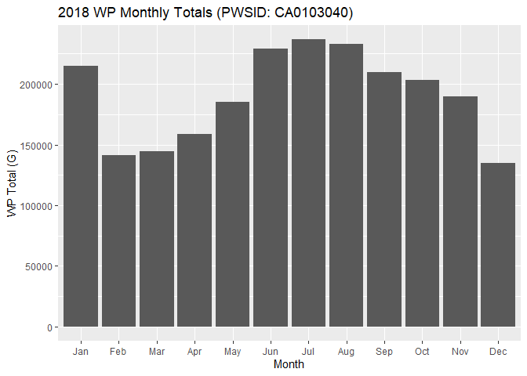

Electronic Annual Report (EAR) Data Download
================
2020-12-02

  - [Intro](#intro)
  - [Download Data](#download-data)
  - [Make a Plot](#make-a-plot)

## Intro

This file demonstrates how to access Electronic Annual Report (EAR) data
from public drinking water systems in California, which is available
from the California Water Resources Control Board’s web site,
[here](https://www.waterboards.ca.gov/drinking_water/certlic/drinkingwater/ear.html).
It also shows an example of how to create a timeseries plot using some
of this data.

## Download Data

Download the zip file to a temporary location, then extract the data
into an R dataframe.

``` r
library(dplyr)
library(readr)

# define the year to download
year <- 2018
dataset_link <- paste0('https://www.waterboards.ca.gov/drinking_water/certlic/drinkingwater/documents/ear/earsurveyresults_', 
                       year, 
                       'ry.zip')

# create a temporary file (to store the zip file)
temp_file <- tempfile()

# download the zip file
download.file(dataset_link, temp_file)

# get the name of the text file
file_name <- unzip(temp_file, list = TRUE) %>% pull(Name)

# create a connection to the file
con <- unz(temp_file, file_name)

# read the data into a data frame
df_ear_results <- read_tsv(con)
# NOTE: to see problems/errors in importing data from the text file to R, use: 
# problems(df_ear_results)

# remove the temp file
unlink(temp_file)
```

## Make a Plot

Make a plot of WP (Water Produced) monthly totals for one PWSID for the
given year. This is just an example, and the specific PWSID shown here
was chosen at random from among those with data for all 12 months, so
the plot is not intended to highlight anything unique about this PWSID’s
data.

``` r
library(stringr)
library(ggplot2)
library(glue)

# create a filtered dataset
df_ear_results_filter_totals <- df_ear_results %>% 
    filter(str_detect(QuestionName, '^WP '), # question names that start with "WP "
           str_detect(QuestionName, ' Total$')) %>%  # question names that end with " Total"
    filter(!(QuestionName %in% c('WP Annual Total', 'WP Max Day Total'))) %>% # remove the annual total and max day total data
    mutate(month = str_replace_all(string = QuestionName, 
                                   pattern = c('WP | Total'), 
                                   replacement = '')) %>% 
    mutate(month = factor(month, levels = month.abb)) %>% 
    arrange(month) %>% 
    mutate(month_number = as.integer(month)) %>% 
    mutate(date = as.Date(paste0(Year, '-', month_number, '-1'))) %>% 
    mutate(QuestionResults = as.numeric((QuestionResults)))

# select a PWSID to plot
pwsid_plot <- 'CA0103040'
units <- df_ear_results %>% 
    filter(QuestionName == 'WP Units of Measure', 
                                   PWSID == pwsid_plot) %>% 
    slice(1) %>% 
    pull(QuestionResults)

# make the plot
plot_wp_total <- ggplot(data = df_ear_results_filter_totals %>% 
                            filter(PWSID == pwsid_plot)) +
    geom_bar(mapping = aes(x = month, y = QuestionResults), stat = 'identity') +
    labs(x = 'Month', 
         y = glue('WP Total ({units})'), 
         title = glue('{year} WP Monthly Totals (PWSID: {pwsid_plot})')) +
    geom_blank()

# output the plot
plot_wp_total
```

<!-- -->
